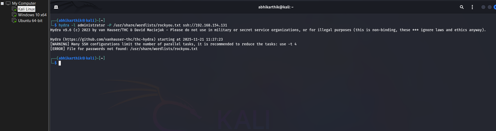
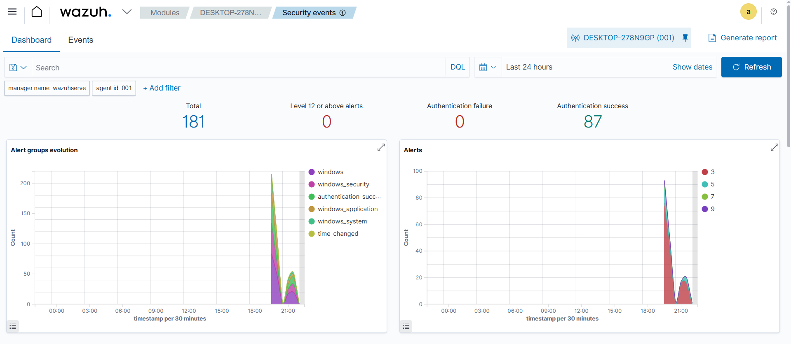
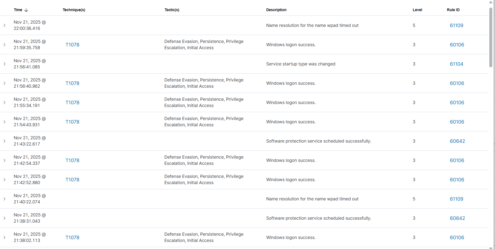

# SOC-Automation-Lab
A home lab demonstrating SIEM implementation, log analysis, and brute-force attack detection using Wazuh.

# SOC Automation Project: Home Lab SIEM

## 🚀 Project Overview
This project focuses on building a functional Security Operations Center (SOC) environment to simulate real-world cyberattacks and practice incident detection and response. 

The objective was to deploy a centralized SIEM (Wazuh) to ingest logs from an endpoint, generate security alerts, and visualize attack data. This lab demonstrates practical application of **CompTIA Security+** concepts including log aggregation, intrusion detection, and continuous monitoring.

## 🛠️ Technologies & Tools Used
* **SIEM/XDR:** Wazuh (Manager & Agent)
* **Virtualization:** VMware Workstation Pro
* **Attacker Machine:** Kali Linux (using Hydra, Nmap)
* **Victim Machine:** Windows 10 (configured with OpenSSH)
* **Networking:** NAT Network configuration for isolated lab environment

## 🏗️ Architecture
Below is the network topology designed for this lab. The environment is isolated using a NAT network to ensure safe simulation of offensive attacks.

## ⚡ Steps to Reproduce

### 1. Infrastructure Setup
Deployed VMware Workstation with three distinct environments:
* **Wazuh Server:** Ubuntu-based server running the Dockerized Wazuh stack.
* **Windows Endpoint:** Configured OpenSSH Server to accept incoming connections on port 22.
* **Kali Linux:** Configured on the same subnet to establish connectivity.

### 2. Agent Deployment
Installed the Wazuh MSI agent on Windows 10. Verified connectivity via PowerShell using `NET START WazuhSvc`.

### 3. Attack Simulation (Proof of Concept)
**Scenario: SSH Brute Force Attack**
Used `Hydra` on Kali Linux to attempt an SSH brute force login against the Windows machine.
*Command:* `hydra -l administrator -P /usr/share/wordlists/rockyou.txt ssh://[Target_IP]`

*Figure 1: Kali Linux terminal executing the Hydra attack.*

### 4. Detection & Analysis
Upon execution of the attacks, the Wazuh Dashboard successfully generated High-Severity alerts.

**The Dashboard View:**

*Figure 2: Real-time telemetry spike showing multiple authentication failures.*

**The Analyst View (Drill-down):**
I investigated the specific alert details to confirm the source of the attack.

*Figure 3: Detailed log analysis revealing the Attacker's IP and the specific Rule ID (5716).*

## 🧠 Lessons Learned
* **Log Analysis:** Learned how to read raw JSON logs to identify the "Source IP" of an attacker.
* **Noise vs. Signal:** Understood the importance of tuning alert thresholds, as a single brute force attack generated thousands of logs.
* **SIEM Deployment:** Gained practical experience in connecting agents and troubleshooting connectivity issues in a virtualized network.
